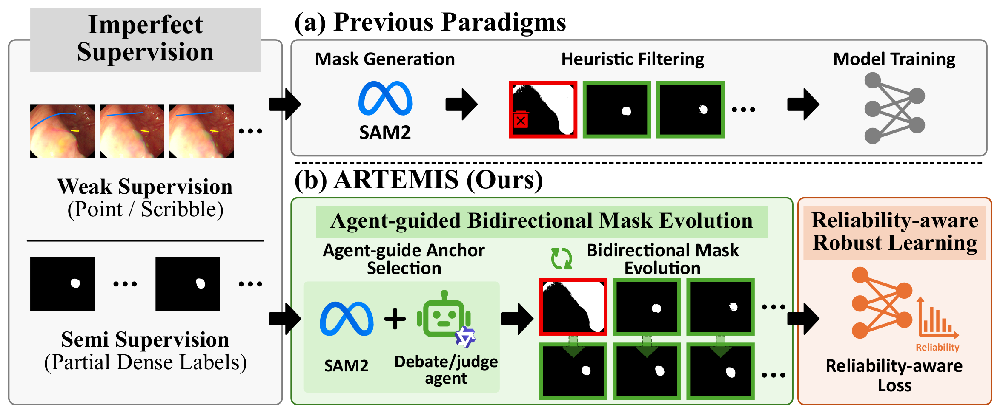
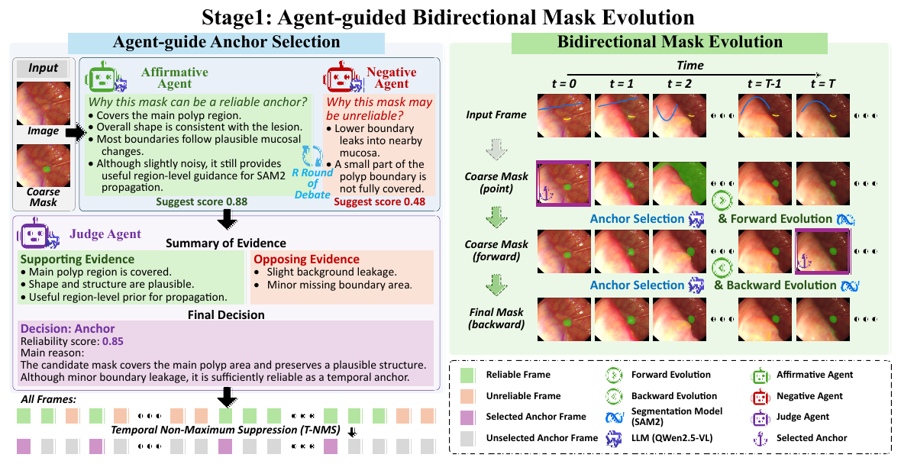
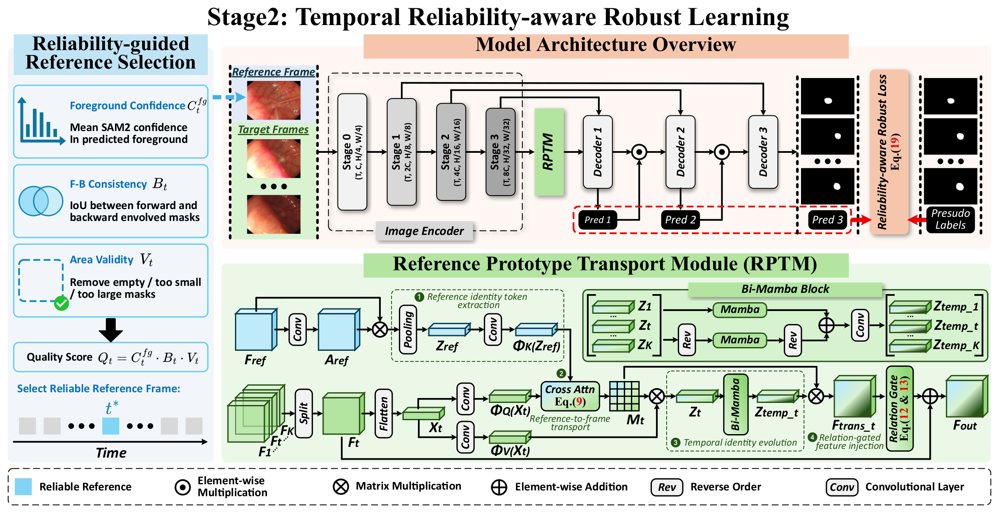
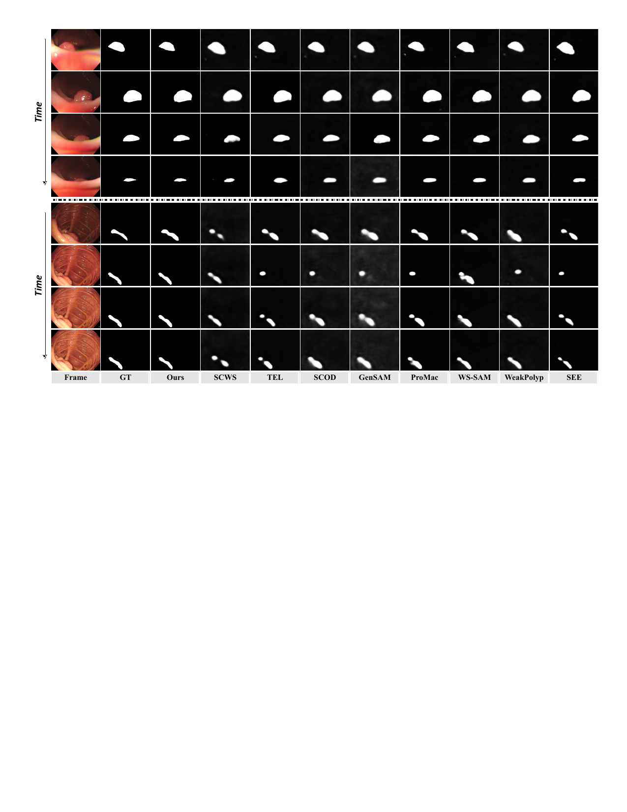
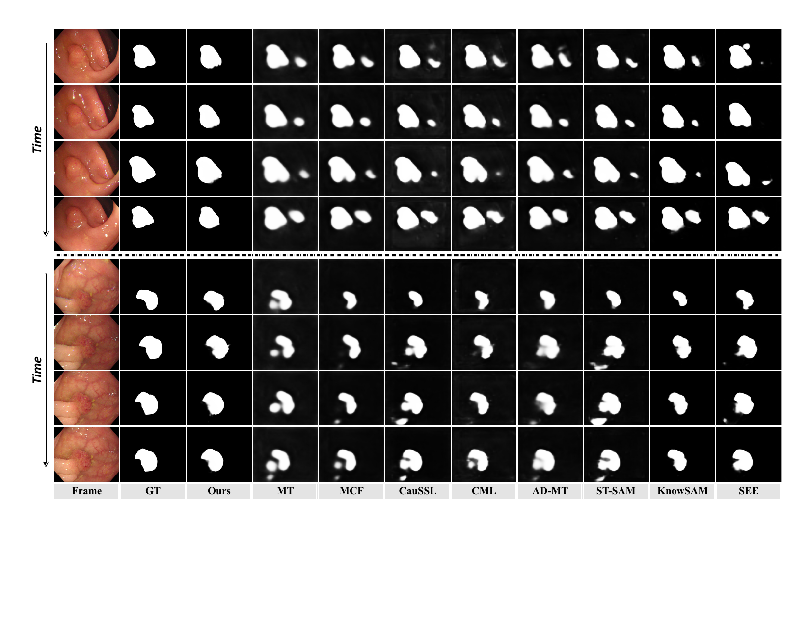

<div align="center">

# 🏹 ARTEMIS

### Agent-guided Reliability-aware Temporal Mask Evolution for Imperfectly Supervised Video Polyp Segmentation

Tong Wang<sup>1,2</sup>, Siwen Wang<sup>2</sup>, Yaolei Qi<sup>1</sup>, Jinxing Zhou<sup>2</sup>, Guanyu Yang<sup>1</sup>, Yutong Xie<sup>2</sup>

<sup>1</sup> Southeast University, China  
<sup>2</sup> Mohamed bin Zayed University of Artificial Intelligence, UAE

Guanyu Yang and Yutong Xie are corresponding authors.

<p>
  <a href="#"></a>
  <a href="#-download-resources"></a>
  <a href="#-code-status"></a>
  <a href="#-citation"></a>
  <a href="#"></a>
</p>

</div>

## 🚀 News

- **[2026/06]** Pseudo-label data, prediction maps, and model snapshots are released for reproducibility.
- **[2026/06]** ARTEMIS repository page is initialized for the submission-stage manuscript.

## 📌 Abstract

Imperfectly supervised video polyp segmentation (VPS) aims to learn dense and temporally consistent masks from inexpensive supervision, including weak annotations such as points and scribbles, as well as semi-supervision with only a small subset of densely labeled frames. Although SAM2 can convert sparse or partial annotations into dense masks, direct pseudo labeling remains limited by geometry-degraded masks, underused temporal propagation, and reliability-blind supervision.

We propose **ARTEMIS**, a unified framework for imperfectly supervised VPS driven by **agent-guided reliability-aware temporal mask evolution**. ARTEMIS first initializes coarse masks from available supervision, then uses a debate-and-judge vision-language agent to select reliable temporal anchors under weak supervision. These anchors are propagated bidirectionally with SAM2 to refine unreliable or unlabeled frames. Finally, ARTEMIS trains the segmenter with temporal reliability-aware robust learning, including reliability-guided reference selection, a Reference Prototype Transport Module, and reliability-aware robust loss. Experiments on SUN-SEG and CVC-ClinicDB-612 under scribble, point, and limited-label settings demonstrate state-of-the-art performance.

## ✨ Highlights

- **Unified imperfect supervision.** ARTEMIS handles weakly supervised and semi-supervised VPS in one complete-then-learn framework.
- **Agent-guided anchor selection.** A debate-and-judge vision-language agent identifies reliable temporal anchors from noisy SAM2-generated masks.
- **Bidirectional temporal mask evolution.** Reliable anchors are propagated forward and backward with SAM2 to complete sparse or missing annotations.
- **Reliability-aware robust learning.** Reliability-guided reference selection, RPTM, and robust loss suppress residual pseudo-label noise while preserving difficult samples.

## 🏗️ Framework Overview

<p align="center">
  
</p>

ARTEMIS follows a two-stage pipeline.

- **Stage 1: Agent-guided bidirectional mask evolution.** Available point, scribble, or sparse dense labels are converted into temporally consistent pseudo masks through reliable anchor selection and SAM2-based propagation.
- **Stage 2: Temporal reliability-aware robust learning.** The final segmenter is trained with reliability-guided reference selection, reference prototype transport, and reliability-aware robust supervision.

<p align="center">
  
</p>

<p align="center"><em>Stage 1: Reliable temporal anchors are selected and propagated bidirectionally to evolve pseudo masks.</em></p>

<p align="center">
  
</p>

<p align="center"><em>Stage 2: Reliable reference identity is transported across frames and noisy supervision is down-weighted.</em></p>

## 📊 Main Results

We evaluate ARTEMIS on **SUN-SEG** under weakly supervised and semi-supervised settings. The tables below report the complete SUN-SEG results of ARTEMIS across Easy/Hard and Seen/Unseen splits. Full comparisons with competing methods and ablation studies are provided in the paper.

### 🧪 Weakly Supervised SUN-SEG Results

| Supervision | Split | Sα↑ | Eφ↑ | Fβ↑ | Dice↑ | IoU↑ | MAE↓ |
| :--- | :--- | ---: | ---: | ---: | ---: | ---: | ---: |
| Scribble | Easy-Seen | **89.7** | **92.4** | **84.1** | **85.2** | **78.3** | **3.4** |
| Scribble | Easy-Unseen | **78.6** | **79.7** | **65.9** | **66.7** | **58.7** | **4.3** |
| Scribble | Hard-Seen | **84.5** | **87.8** | **77.3** | **78.8** | **71.3** | **7.4** |
| Scribble | Hard-Unseen | **79.6** | **81.6** | **67.5** | **68.7** | **60.9** | **4.8** |
| Point | Easy-Seen | **86.3** | **88.7** | **65.4** | **81.2** | **73.2** | **6.8** |
| Point | Easy-Unseen | **77.0** | **76.9** | **52.9** | **62.8** | **53.9** | **8.0** |
| Point | Hard-Seen | **81.5** | **84.0** | **59.2** | **74.8** | **66.0** | **10.0** |
| Point | Hard-Unseen | **77.0** | **78.6** | **52.7** | **64.4** | **55.5** | **8.0** |

### 🧬 Semi-supervised SUN-SEG Results

| Supervision | Split | Sα↑ | Eφ↑ | Fβ↑ | Dice↑ | IoU↑ | MAE↓ |
| :--- | :--- | ---: | ---: | ---: | ---: | ---: | ---: |
| 1/8 labeled | Easy-Seen | **90.7** | **93.6** | **85.2** | **86.5** | **79.9** | **2.7** |
| 1/8 labeled | Easy-Unseen | **79.4** | **81.1** | **67.1** | **68.2** | **60.4** | **4.8** |
| 1/8 labeled | Hard-Seen | **86.2** | **90.1** | **78.2** | **80.0** | **72.2** | **4.5** |
| 1/8 labeled | Hard-Unseen | **80.8** | **83.9** | **69.4** | **70.9** | **63.1** | **4.6** |
| 1/16 labeled | Easy-Seen | **89.9** | **92.4** | **84.3** | **85.5** | **78.9** | **3.4** |
| 1/16 labeled | Easy-Unseen | **78.3** | **79.8** | **66.0** | **66.9** | **58.9** | **4.9** |
| 1/16 labeled | Hard-Seen | **84.5** | **87.9** | **77.4** | **79.1** | **71.5** | **7.6** |
| 1/16 labeled | Hard-Unseen | **79.2** | **81.4** | **67.1** | **68.2** | **60.2** | **5.0** |

<small>All values are percentages (%). Higher is better except MAE.</small>

## 🖼️ Qualitative Results

<p align="center">
  
</p>

<p align="center"><em>Qualitative comparison under scribble supervision. ARTEMIS better preserves blurry, drifting, and small polyp regions.</em></p>

<p align="center">
  
</p>

<p align="center"><em>Qualitative comparison under the 1/8 labeled training data setting. ARTEMIS reduces over-segmentation and under-segmentation for background-like polyps.</em></p>

## 📂 Download Resources

We provide the processed pseudo-label data, prediction maps, and trained model snapshots via OneDrive. These resources are released for reproducibility and comparison while the source code remains unavailable during peer review.

### 🗂️ Dataset and Pseudo Labels

| Resource | Description | Link |
| :--- | :--- | :---: |
| Dataset | Dataset package used by ARTEMIS experiments | [Download](https://mbzuaiac-my.sharepoint.com/:f:/g/personal/tong_wang_mbzuai_ac_ae/IgBoQdoKNmJGS5EWRMYgPYErAcjPfrxMmQp6na-_IGPOrSM?e=i3WAMp) |
| Scribble / Point | Weak annotation files | [Download](https://mbzuaiac-my.sharepoint.com/:u:/g/personal/tong_wang_mbzuai_ac_ae/IQBRS-IF7-hyTZRRExwSg7h3ASnV7u0DpEX2zUd2DrbCs9w?e=he9J8M) |
| Point2Mask | Coarse masks generated from point prompts | [Download](https://mbzuaiac-my.sharepoint.com/:u:/g/personal/tong_wang_mbzuai_ac_ae/IQAxGte0XaGMRY28NshQtk7rAdz_G4WFJsqrRIjOMOAmoBA?e=H96gMt) |
| Mask2Mask Forward | Forward-evolved pseudo masks | [Download](https://mbzuaiac-my.sharepoint.com/:u:/g/personal/tong_wang_mbzuai_ac_ae/IQDW9JkRz9onSrhLLGRSQpWVAU3dBa9-ZqU7EgCuOOMlswI?e=J2pST5) |
| Mask2Mask Forward Logit | Forward propagation logits | [Download](https://mbzuaiac-my.sharepoint.com/:u:/g/personal/tong_wang_mbzuai_ac_ae/IQAeO1beBa_tS4p0DCF3KSC0Afrw8Nu2hQtbAx_NNFN3jh8?e=fC338x) |
| Mask2Mask Backward | Backward-evolved pseudo masks | [Download](https://mbzuaiac-my.sharepoint.com/:u:/g/personal/tong_wang_mbzuai_ac_ae/IQCfPeF9oNxBRIJ1Myt0plGLAQNJCMcqMV6AXmAnSeTXxDY?e=aEH6f6) |
| Mask2Mask Backward Logit | Backward propagation logits | [Download](https://mbzuaiac-my.sharepoint.com/:u:/g/personal/tong_wang_mbzuai_ac_ae/IQDpacdRxwYNRauOLwpM-R5YAfU9UO4dk7e-oQV6-Kg5twk?e=r54sd5) |
| Reliable Reference Cache | Cached reliability-guided reference information | [Download](https://mbzuaiac-my.sharepoint.com/:u:/g/personal/tong_wang_mbzuai_ac_ae/IQA5GKybOWTzRYgVzP60eso1AVVQ5yCwhX-_d3ypcFY7F7Y?e=bMKTe1) |

### 🖼️ Prediction Maps

| Resource | Link |
| :--- | :---: |
| All Predictions | [Download](https://mbzuaiac-my.sharepoint.com/:f:/g/personal/tong_wang_mbzuai_ac_ae/IgBl-oYdEy1RSbNIv9KSQ4PsATq2os23Z7YKPGvKXE7dPPo?e=TybeCf) |
| ARTEMIS Scribble Predictions | [Download](https://mbzuaiac-my.sharepoint.com/:u:/g/personal/tong_wang_mbzuai_ac_ae/IQBlkjlYi3ATTbKN_LC5rg7HAVxkk-LyDaQCJlWwo0LYEWI?e=JkMHSd) |
| ARTEMIS Point Predictions | [Download](https://mbzuaiac-my.sharepoint.com/:u:/g/personal/tong_wang_mbzuai_ac_ae/IQC9osl2UFu_Tok1xL9xwIcPASDnp7Mmf8Gdye_dm8LspV0?e=OP8QZx) |
| ARTEMIS 1/8 Data Predictions | [Download](https://mbzuaiac-my.sharepoint.com/:u:/g/personal/tong_wang_mbzuai_ac_ae/IQA0nrh71c6LTYIQ_m8AkUouAZnABym0j9pbdZyKf812rKE?e=DOZVnK) |
| ARTEMIS 1/16 Data Predictions | [Download](https://mbzuaiac-my.sharepoint.com/:u:/g/personal/tong_wang_mbzuai_ac_ae/IQDMnmI8lu0JQ4rX1M0TyYmGAZ5O5N1j9WgfYEYOk_HwHl4?e=o7etgt) |

### 🧩 Model Snapshots

| Resource | Link |
| :--- | :---: |
| All Snapshots | [Download](https://mbzuaiac-my.sharepoint.com/:f:/g/personal/tong_wang_mbzuai_ac_ae/IgBJwNJAn3wfRJiyBlIkQASzARZZUPRDehg9YxbOzsqRiWM?e=JQhaYw) |
| ARTEMIS Scribble Snapshot | [Download](https://mbzuaiac-my.sharepoint.com/:f:/g/personal/tong_wang_mbzuai_ac_ae/IgDYwh9JOWoRQJrVrjI51n28AcXSO0bFMHTdxuCnkMci6hw?e=0cbeHu) |
| ARTEMIS Point Snapshot | [Download](https://mbzuaiac-my.sharepoint.com/:f:/g/personal/tong_wang_mbzuai_ac_ae/IgB6C6Jvqgw_Q7oVpcNhk4lXAZo4wjE0N7WncOkVGRM7g50?e=TroNnH) |
| ARTEMIS 1/8 Data Snapshot | [Download](https://mbzuaiac-my.sharepoint.com/:f:/g/personal/tong_wang_mbzuai_ac_ae/IgB7XyoBxl1dTqqDes9n_faQAcuyTW_0BKCyG43e1ibFlic?e=k2BnVI) |
| ARTEMIS 1/16 Data Snapshot | [Download](https://mbzuaiac-my.sharepoint.com/:f:/g/personal/tong_wang_mbzuai_ac_ae/IgAzyScT5MatQbG4bp-ui7KMAfJT-xr44YJ-ZdQIIOWwlGs?e=VHbe9d) |

## 🛠️ Code Status

This repository is currently maintained for the submission-stage manuscript. Source code, training scripts, and testing scripts are not released during peer review.

The full code will be made available after acceptance.

## 📖 Citation

If you find ARTEMIS useful, please consider citing our work. The BibTeX entry will be updated with the official venue or preprint information when it becomes available.

```bibtex
@article{wang2026artemis,
  title={ARTEMIS: Agent-guided Reliability-aware Temporal Mask Evolution for Imperfectly Supervised Video Polyp Segmentation},
  author={Wang, Tong and Wang, Siwen and Qi, Yaolei and Zhou, Jinxing and Yang, Guanyu and Xie, Yutong},
  journal={Under review},
  year={2026}
}
```

## 📬 Contact

For questions about the paper or future code release, please contact [tongwangnj@qq.com](mailto:tongwangnj@qq.com).
